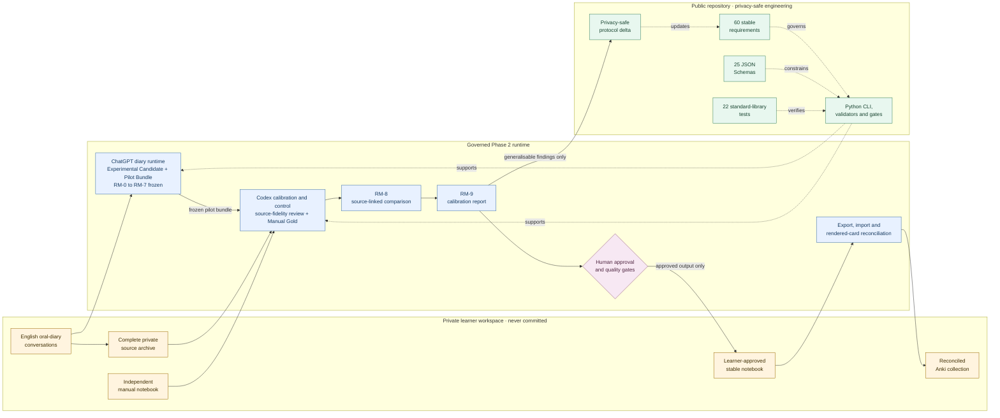

# AI-Assisted Language Learning System


## A Privacy-First AI-Assisted Language Learning System


The AI-Assisted Language Learning System is an experimental, privacy-first system for converting
selected everyday English reflections into traceable learning targets,
structured notebooks, and governed Anki review material. It combines a
human-in-the-loop learning protocol with schema-defined data contracts, Python
validation tooling, explicit state transitions, and calibration against an
independently prepared manual-gold reference.

> **Release status: v0.1.0-alpha.** This repository is an experimental protocol,
> private-calibration architecture, and structural pilot runtime. It is not a
> production automation system and does not authorise direct import of an
> Experimental Candidate into Anki.

## Project at a glance

- **Problem:** generic study material often misses the language a learner
  actually needs for real communication.
- **Approach:** use private oral diaries as source material, preserve provenance
  through a governed transformation pipeline, and route ambiguity to human
  review rather than hiding it behind automatic output.
- **Public engineering evidence:** 60 stable requirements, 25 JSON Schemas, a
  Python structural CLI, privacy and linkage validators, calibration reports,
  and 22 passing standard-library tests.
- **Pilot evidence:** two private end-to-end Shadow Mode cycles completed through
  manual-gold comparison, reviewed notebook finalisation, Anki reconciliation,
  and learner review. Only non-reconstructive aggregate findings are public.
- **Current boundary:** semantic topic reconstruction and learning-target
  selection still require governed review; production autonomy is not claimed.

## What this project demonstrates

- translating an ambiguous human learning process into explicit requirements,
  data contracts, state transitions, and quality gates;
- privacy-by-design separation between public code and private learner data;
- source-to-output traceability and structured exception handling;
- human-in-the-loop evaluation using frozen predictions, manual-gold comparison,
  error classes, and calibration reports;
- iterative improvement based on observed failure modes rather than unsupported
  accuracy claims.

## System architecture



Solid arrows show the private artefact flow. Dotted arrows show how the public
requirements, schemas, tests, and tooling govern that flow without receiving
private learner content. Only generalisable, non-reconstructive findings may
return to the public protocol. See the [system overview](docs/system-overview.md)
and [privacy boundary](docs/privacy-and-data-boundaries.md) for the detailed
design.

## Verify the public foundation

The public repository uses synthetic fixtures and contains no private diary
content. The structural test suite can be run with:

```bash
python -m unittest discover -s tests -v
```

The Phase 2 command-line surface can be inspected with:

```bash
python pipeline/eod.py --help
```

## Learning purpose

English Oral Diary is also a long-term learning system for turning English into
a tool for everyday reflection, communication, and thought.

It is designed for learners who already have a working foundation in English but struggle to use it naturally in daily life. It is not an exam-preparation course, a vocabulary-drilling programme, or a promise of rapid improvement. Its premise is that durable speaking ability grows through repeated use, personally meaningful expression, careful feedback, and long-term memory practice.

## The learning model

The system has two dependent stages.

### Stage 1 — Build an English oral-diary habit

The learner regularly reflects on daily life with an AI in English, ideally as a stable part of an existing journaling or evening-reflection routine.

At the beginning, the diary may be a simple account of the day. The learner does not need polished stories or clearly separated topics. The priorities are to keep communicating in English, describe unknown concepts using available English, and gradually learn to organise experience into clearer topics and reasoning chains.

The habit becomes sustainable when the conversation itself is useful: it helps the learner notice patterns, examine uncertainty, encounter new perspectives, and think more clearly. English practice is therefore connected to a meaningful activity instead of being maintained by discipline alone.

### Stage 2 — Convert lived language into long-term memory

Once the oral diary is stable, a governed pipeline transforms selected material into a structured learning notebook and then into Anki notes.

The intended flow is:

```text
English oral diary
→ topic reconstruction
→ learning-signal detection
→ learning-target selection
→ structured notebook
→ automated quality gates
→ Anki notes
→ spaced review
→ more fluent future expression
```

The material is useful because it originates in language the learner wanted for real situations. The system aims to preserve that relevance while preventing semantic drift, weak cards, accidental omissions, and unreliable automation.

## Core principles

- Long-term integration matters more than short-term performance.
- English should increasingly connect meaning to meaning, rather than always passing through translation from the learner's first language.
- The learner's real communicative need is a stronger selection signal than abstract difficulty.
- AI is both a language partner and a tool for clearer reflection, but its outputs must remain traceable and auditable.
- Generated learning material must preserve the source meaning, including actor, event, causality, stance, certainty, and important qualifications.
- A learning target counts as covered only when it appears in an actual tested position.
- One detected error invalidates the relevant audit and triggers a scan for the entire error class.
- Automation should reduce routine human review while routing genuine ambiguity to explicit review.
- Private learning content remains under the learner's control and outside the repository.

## Project status

Phase 1 is complete. The privacy-reviewed Protocol v3.5 baseline has been
migrated to Markdown; all legacy clauses have recorded dispositions; and 60
cross-process requirements have stable machine-readable IDs and validation
evidence. Twenty-five schemas define the current data contracts. The existing protocol is
strongest in notebook correction, quality auditing, card design, rendering, and
Anki reconciliation. The next research and engineering priority is the front of
the pipeline: reliably turning unstructured oral-diary material into a
high-quality first notebook draft.

Protocol v3.5 remains the current stable governing baseline. The separately
named Protocol v3.6-draft Shadow Mode Profile is an experimental Phase 2 overlay,
not a promoted stable replacement. Both remain in force within their stated
scopes until an explicit promotion decision creates a stable v3.6 release.

No production automation is claimed yet.

Phase 2 currently separates the ChatGPT diary runtime from the Codex calibration
runtime. It includes external private-session workspaces, a ChatGPT-to-Codex
Pilot Bundle, complete private source-archive intake, source-fidelity and
manual-gold handoff contracts, content-free status reporting, RM-8 comparison,
and RM-9 calibration reports. It does not yet generate learning targets or
deterministically evaluate diary semantics.

Two private end-to-end Shadow Mode cycles have completed through stable Anki
reconciliation and learner card review. Their content remains outside this
repository. The results are calibration evidence only: they identified
substantial first-draft selection differences and strengthened Topic Retell,
Manual-Gold coverage, lexical citation-form, synonym-contrast, and Context
Cloze card-count controls, but they do not establish production readiness or
authorise automatic import.

## Documentation

- [Learning philosophy](docs/learning-philosophy.md)
- [Intended learners and boundaries](docs/learner-profile.md)
- [System architecture](docs/system-overview.md)
- [Privacy and data boundaries](docs/privacy-and-data-boundaries.md)
- [Protocol gap analysis](docs/protocol-gap-analysis.md)
- [Roadmap](docs/roadmap.md)
- [Evaluation framework](docs/evaluation-framework.md)
- [Current project status](docs/project-status.md)
- [Configuration boundaries](docs/configuration.md)
- [Phase 1 completion report](docs/phase-1-completion.md)
- [Phase 2 calibration workflow](docs/phase-2-calibration-workflow.md)
- [Phase 2 pilot runtime](docs/phase-2-pilot-runtime.md)
- [Phase 2 Pilot 1 aggregate findings](docs/phase-2-pilot-1-findings.md)
- [Phase 2 Pilot 2 aggregate findings](docs/phase-2-pilot-2-findings.md)
- [Experimental Raw Material Processing Specification v0.1](protocol/experimental/raw-material-processing-spec-v0.1.md)
- [Protocol v3.6-draft Shadow Mode Profile](protocol/experimental/english-oral-diary-protocol-v3.6-draft-shadow-mode-profile.md)
- [Phase 2 Interchange Contract v0.1](protocol/experimental/phase-2-interchange-contract-v0.1.md)
- [Replacement ChatGPT Project Instructions](protocol/experimental/chatgpt-project-instructions-phase-2-replacement.txt)

## Repository policy

This repository contains system specifications, schemas, validation logic, and privacy-safe implementation code. It must not contain real oral diaries, AI conversations, manually edited notebooks, Anki collections, exports containing personal learning material, screenshots, or logs derived from private sessions.

See [CONTRIBUTING.md](CONTRIBUTING.md) before adding files.

## Licence

Copyright 2026 Jingxian (Grace) Du.

Licensed under the [Apache License 2.0](LICENSE). See [NOTICE](NOTICE) for
attribution information.
